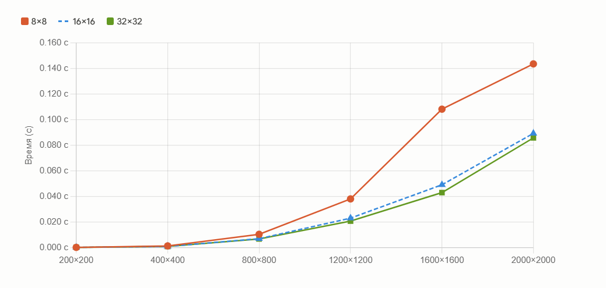

# Лабораторная работа 4.

___

Я добавила к коду реализации перемножения на с++ (лабораторная работа 1) поддержку CUDA. Также выполнила проверку на правильность перемножения. В таблице приведено время выполнения программы в секундах для разного размера матриц и с различными конфигурациями сетки блоков:

| Размер матрицы | 8×8 | 16×16 | 32×32 |
|:--------------:|:-------:|:---------:|:---------:|
| 200×200        | 0.000152 | 0.000151 | 0.000155 |
| 400×400        | 0.001304 | 0.000876 | 0.000864 |
| 800×800        | 0.010379 | 0.006921 | 0.006753 |
| 1200×1200      | 0.038032 | 0.023013 | 0.020687 |
| 1600×1600      | 0.108189 | 0.049082 | 0.042963 |
| 2000×2000      | 0.143595 | 0.089267 | 0.085754 |

График зависимости времени выполнения от размера матрицы при различных конфигурациях сетки блоков:

Вывод: Использование CUDA позволило значительно ускорить умножение матриц. Среди протестированных конфигураций наилучшие результаты показал размер блока 32×32 — он стабильно быстрее 16×16 и 8×8 на всех размерах матриц. Блок 8×8 оказался наихудшим вариантом, так как содержит мало потоков и не загружает GPU полностью. На малых матрицах (200×200) разница между конфигурациями незначительна.