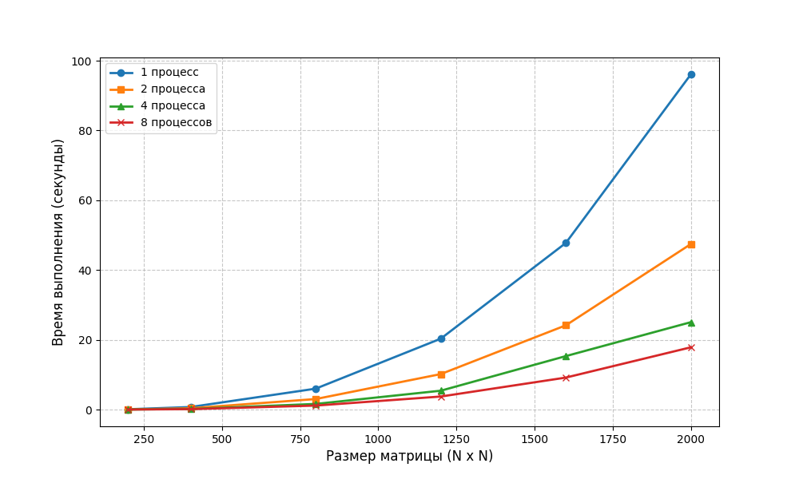

# Лабораторная работа 3.

---

Я добавила к коду лабораторной работы 1 (перемножение матриц на с++) поддержку технологии MPI. Также выполнила проверку на правильность перемножения. В таблице приведено время выполнения программы в секундах для разного количества процессов и размера матрицы:

| Размер матрицы | 1 процесс | 2 процесса | 4 процесса | 8 процессов |
| :------------- | :-------- | :--------- | :--------- | :---------- |
| 200            | 0.0984    | 0.0477     | 0.0334     | 0.0213      |
| 400            | 0.7444    | 0.3895     | 0.1931     | 0.1425      |
| 800            | 6.0052    | 3.0308     | 1.6284     | 1.1614      |
| 1200           | 20.3309   | 10.1855    | 5.4195     | 3.7517      |
| 1600           | 47.7665   | 24.1610    | 15.3383    | 9.1835      |
| 2000           | 96.1156   | 47.4684    | 25.0669    | 17.8657     |

#### Зависимость времени выполнения алгоритма от размера матриц при разном количестве процессов представлена на графике:

Вывод: Тесты показали, что технология наиболее эффективна на больших объемах данных: для матрицы 2000x2000 удалось сократить время с полутора минут до 17 секунд. На маленьких матрицах (200–400) прирост скорости не такой значительный, так как много времени уходит на «общение» процессов между собой.
