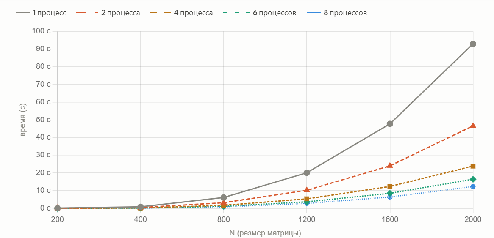

#  Лабораторная работа 5.

---

Я использовала код с поддержкой технологии MPI (лабораторная работа 3) на суперкомпьютере «Сергей Королёв». Также выполнила проверку на правильность перемножения. В таблице приведено время выполнения программы в секундах для разного количества процессов и размера матрицы:

| N    | 1 процесс (с) | 2 процесса (с) | 4 процесса (с) | 6 процессов (с) | 8 процессов (с) |
|-----:|--------------:|---------------:|---------------:|----------------:|----------------:|
|  200 |        0.1060 |         0.0536 |         0.0275 |          0.0188 |          0.0235 |
|  400 |        0.8354 |         0.4184 |         0.2110 |          0.1409 |          0.1049 |
|  800 |        6.1113 |         3.1737 |         1.6823 |          1.1342 |          0.8485 |
| 1200 |       20.0919 |        10.1972 |         5.3456 |          3.6605 |          2.7896 |
| 1600 |       47.7437 |        23.9999 |        12.3580 |          8.4748 |          6.3786 |
| 2000 |       92.9650 |        46.6017 |        23.8698 |         16.3986 |         12.2997 |

#### Зависимость времени выполнения алгоритма от размера матриц при разном количестве процессов представлена на графике:

Вывод: Результаты измерений показали, что с увеличением числа процессов время выполнения заметно сокращается. На больших матрицах ускорение близко к линейному — 8 процессов работают примерно в 7.5 раз быстрее одного. На малых матрицах эффект меньше, тк накладные расходы на передачу данных между процессами перевешивают выгоду от параллелизма.
